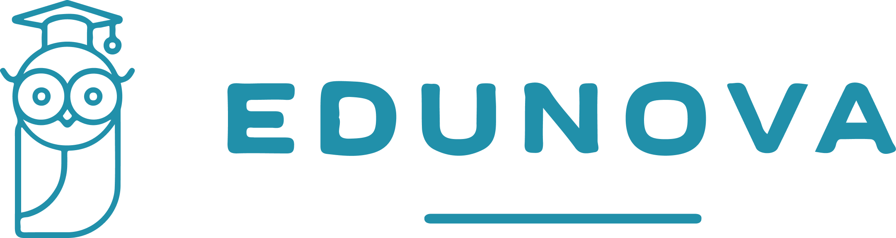
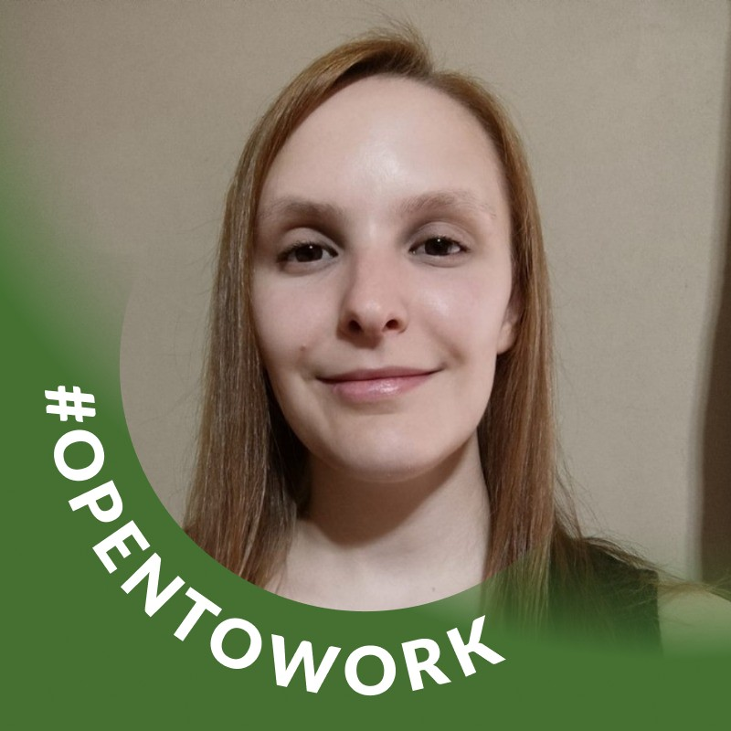
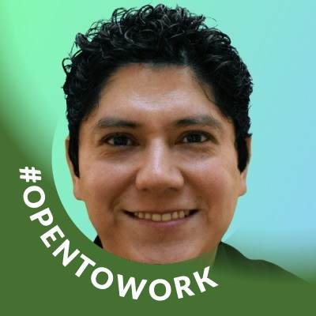
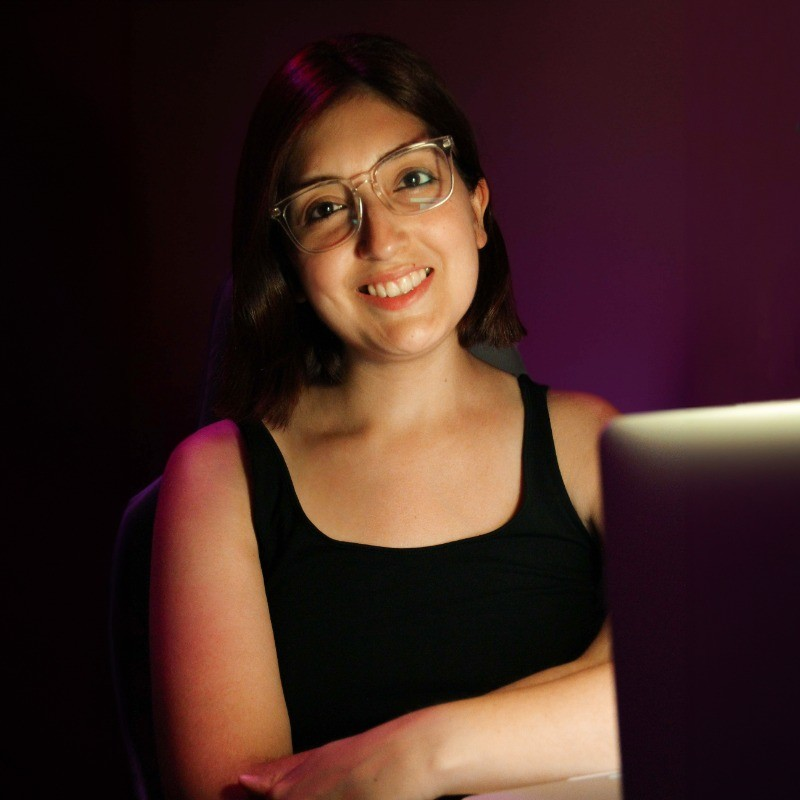

### Abriendo puertas hacia la educación moderna

Plataforma EdTech diseñada y desarrollada para una institución en particular, que promete facilitar el trabajo a alumnos y docentes.

Cuenta con un sistema de matriculación online, fácil contacto con el área administrativa de la institución y foro de debate dentro de la misma plataforma.

### Público Objetivo 👥

-   **Alumno**: Podrán matricularse a materias y estar en contacto con sus compañeros y docentes.

-   **Docente**: Tendrán control de sus alumnos, calificaciones y promedios además de interactuar con ellos.

-   **Administrador**: Tendrá acceso a la información de todo el personal de la institución y podrá controlarlo.

-   **Universidad**: Es la encargada de administrar la plataforma y asignar administradores.

## Resolvemos

### Intuición - Diseño - Practicidad - Administración

## Equipo de Trabajo 🚀

  

    
    
<strong>Silvia Gallo</strong>

    
<em>UX/UI</em>

    

      
    

  

  

    
    
<strong>Carlos Hidalgo</strong>

    
<em>UX/UI</em>

    

      
    

  

  

    
    
<strong>Luis Vera</strong>

    
<em>Back-end</em>

    

      
    

    

      
    

  

  

    
    
<strong>Eduardo Aguilar</strong>

    
<em>Front-end</em>

    

      
    

    

      
    

  

  

    
    
<strong>Paola González</strong>

    
<em>Front-end</em>

    

      
    

    

      
    

  

## Tecnologías 🔧

### UX/UI

  
 
  

### Front-end

  
  
  
  

### Back-end

 
 
  
    

### Herramientas de Organización/Comunicación

  
  
  
  
   
 

## Enlaces de Proyecto 🔗

#### En estos meses el proyecto se enfocó en el rol de administrador como usuario.

-   Repositorio: [https://github.com/LuisVera1/c18-06-m-node-react](https://github.com/No-Country/c18-06-m-node-react)
-   Sitio web: [https://c18-06-m-node-react.vercel.app/](https://c18-06-m-node-react.vercel.app/)

#### Las credenciales son entregadas por el administrador para el inicio de sesión.

-   Prototipos: [https://www.figma.com/proto/SPotysNu8Nsmd3Qq7jDog4/Proyecto-No-Country?node-id=1802-1740&t=EVEArbYTJufC7Stq-1&scaling=scale-down&content-scaling=fixed&page-id=102%3A537&starting-point-node-id=1802%3A1740](https://www.figma.com/proto/SPotysNu8Nsmd3Qq7jDog4/Proyecto-No-Country?node-id=1802-1740&t=EVEArbYTJufC7Stq-1&scaling=scale-down&content-scaling=fixed&page-id=102%3A537&starting-point-node-id=1802%3A1740)

## Expresiones de Gratitud 🙌🏻

Agradecimientos a No Country
